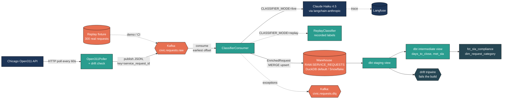
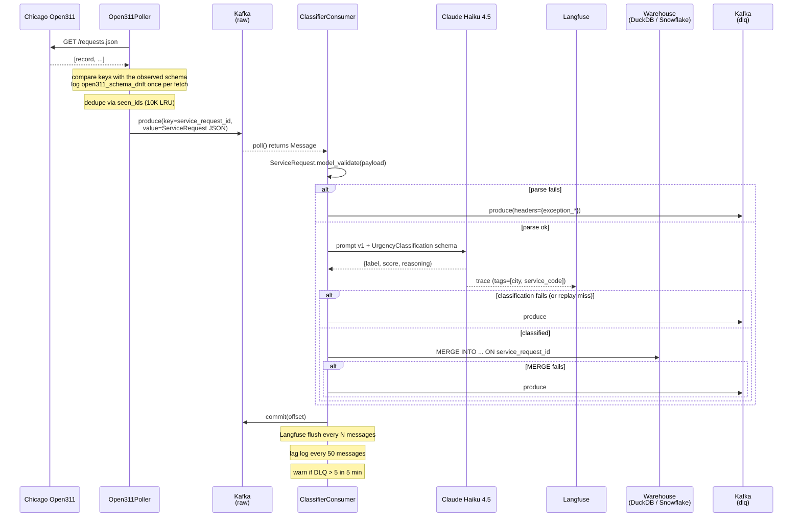
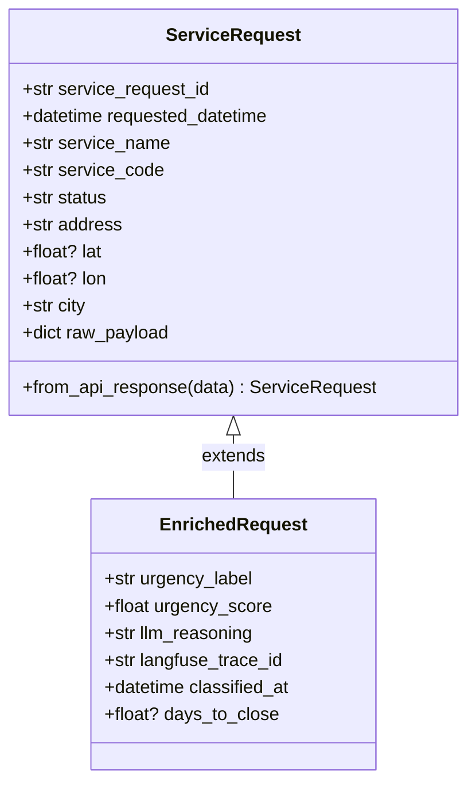
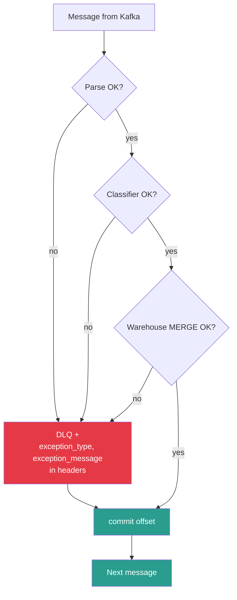

# Architecture

How a single Chicago 311 service request flows from the public API through
Kafka, an LLM classifier, the warehouse (DuckDB locally, Snowflake in
production) and dbt, and where each failure mode is handled.

## System overview

Two processes run independently: the **poller** (HTTP → Kafka) and the
**classifier consumer** (Kafka → classifier → warehouse, or DLQ). Polling
cadence never waits on LLM latency, and the consumer can scale out across the
raw topic's 3 partitions.

Two switches change the edges without changing the code path:

| Variable | Values | Effect |
|---|---|---|
| `WAREHOUSE_BACKEND` | `duckdb` (default), `snowflake` | Which writer the consumer and scripts get from `warehouse.build_writer()` |
| `CLASSIFIER_MODE` | `live` (default), `replay` | Claude call, or a lookup of the label Claude gave the same request when the fixture was recorded |
| `DBT_TARGET` | `local` (default), `snowflake` | dbt-duckdb or dbt-snowflake; the models are shared |

## Request lifecycle (sequence)

## Component responsibilities

| Component | Owns | Key invariants |
|---|---|---|
| `ingestion/open311_poller.py` | HTTP polling, dedup, schedule, drift reporting | Never blocks; one failing service code doesn't stop the others; non-object records are skipped, not fatal |
| `ingestion/schemas.py` | `ServiceRequest` / `EnrichedRequest`, the observed key set | `raw_payload` keeps the untouched API record, including unknown keys |
| `ingestion/kafka_producer.py` | JSON serialization, keying | Message key is always `service_request_id` (UTF-8 bytes) |
| `classifier/urgency_classifier.py` | LangChain chain, structured output, Langfuse callback | Exactly one of 4 labels; confidence in [0, 1]; one-sentence reasoning |
| `classifier/replay_classifier.py` | Recorded labels for the demo and CI | Never invents a label: a miss raises `ReplayMiss` and goes to the DLQ |
| `classifier/consumer.py` | Kafka loop, DLQ routing, observability | `auto.offset.reset=earliest`; commit after the warehouse write or DLQ send; signal-safe shutdown; `--exit-when-idle` for draining |
| `warehouse/duckdb_writer.py` | Local MERGE upsert | Idempotent on `service_request_id`; timestamps stored as UTC wall-clock (Snowflake NTZ parity); JSON `raw_payload`; connection held only per batch so dbt can open the file |
| `warehouse/snowflake_writer.py` | Snowflake MERGE upsert | Idempotent on `service_request_id`; chunks at 100 rows; VARIANT via `PARSE_JSON` |
| `dbt_project/` | SQL transformations, SLA macro, cross-db macros, tests | Staging is a view; marts are tables; SLA and drift thresholds live in `vars` only |

## Data contracts

`ServiceRequest` is the Kafka payload. `EnrichedRequest` is the row written
to `RAW.SERVICE_REQUESTS` (one column per field, in the order of
`warehouse.COLUMNS`) and one line of the replay fixture. No raw dicts cross
module boundaries.

The two warehouses hold the same table:

| Column | DuckDB | Snowflake |
|---|---|---|
| `raw_payload` | `JSON` | `VARIANT` |
| `requested_datetime`, `classified_at` | `TIMESTAMP` (UTC) | `TIMESTAMP_NTZ` (UTC) |
| Key | `PRIMARY KEY (service_request_id)` | `PRIMARY KEY (service_request_id)` |

Only two SQL constructs differ between engines: reading a JSON key and
parsing a timestamp leniently. They go through `macros/cross_db.sql`, whose
Snowflake branch renders the original SQL unchanged.

## SLA model

Thresholds (hours) are defined once, in `dbt_project.yml`:

| Urgency | Hours | Days |
|---|---:|---:|
| Critical | 4 | 0.17 |
| High | 24 | 1.0 |
| Medium | 72 | 3.0 |
| Low | 168 | 7.0 |

The `sla_threshold_hours()` macro renders a CASE expression from those
vars. `int_resolved_requests` derives `hours_to_close` from
`raw_payload.updated_datetime - requested_datetime` and sets `met_sla =
hours_to_close <= sla_threshold_hours(urgency_label)`. Unknown urgency →
NULL threshold → excluded from `closed_within_sla` and `classified_requests`
but still counted in `total_requests`. `sla_pct` is NULL when
`classified_requests = 0`.

`updated_datetime` is Open311's last status change, used as the close time.
The backfill loads requests that are already closed, so compliance measured on
a backfill window is biased upward. See the README's limits section.

## Failure handling

A failure at any stage routes the **original raw bytes** to the DLQ with the
exception type and message; the offset commit still happens so a poison
message can't wedge the consumer. The DLQ can be replayed once the cause is
fixed (LLM outage, schema change, transient warehouse error). The sliding-window
DLQ rate alert (`dlq_rate_alert`, more than 5 in 5 minutes) signals a systemic
cause: an upstream API change, expired credentials, a prompt regression.

### Schema drift

Upstream changes are caught at two layers:

| Layer | Detects | Response |
|---|---|---|
| Poller | Missing or unexpected keys against the 10 keys every record carried in the 2026-09-23 survey (7,493 records); spec-optional Open311 fields are allowed | One aggregated `open311_schema_drift` warning per fetch; the record is kept, unknown keys preserved in `raw_payload` |
| Poller | Unparseable `requested_datetime` or coordinates, non-object records, a non-list envelope | Record skipped with an error log; the rest of the batch flows |
| dbt | More than `max_unparseable_close_time_pct` (1%) of closed rows without a parseable `updated_datetime` | `assert_closed_requests_have_close_time` fails and `dbt build` skips everything downstream |

The dbt layer exists because the SQL fails quietly: a renamed close-time field
filters every row out of `int_resolved_requests`, and the marts build empty
with every other test green. `tests/test_dbt_drift_tripwire.py` reproduces
both sides of that on the real fixture.

## Why these choices

- **Kafka, not a queue + DB**: backpressure, replay from any offset, partition
  scaling, and a DLQ that is just another topic. Keying by
  `service_request_id` keeps log compaction available.
- **Claude Haiku 4.5 with structured output**: ~1,290 input and ~100 output
  tokens per request (measured), about $0.0018 each or ~$1.80 per 1,000 at
  $1 / $5 per million tokens. The schema-constrained output removes
  label-parsing failures, and the prompt is versioned (`PROMPT_VERSION`)
  so traces and evaluations can be compared across revisions.
- **Langfuse**: native LangChain callback; traces carry the prompt, the
  structured output, token counts and `prompt_version`, and the trace ID is
  stored on the warehouse row.
- **MERGE, not INSERT or COPY**: idempotency on `service_request_id`.
  Re-delivery and repeated backfills do not duplicate; the streaming consumer
  and the bulk backfill share the writer. The first DuckDB backfill absorbed 10
  records that the API returned twice across page boundaries.
- **DuckDB as the default warehouse**: anyone can run the full pipeline and
  every dbt test without an account, and CI runs the same dbt project on real
  data on every push. Snowflake remains a target, and nothing in the models is
  specific to either engine.
- **Replay instead of a mocked classifier**: the demo and CI replay labels
  Claude actually produced for real requests, so the marts they build show real
  model behaviour. A mock would test the plumbing with invented labels.
- **dbt staging as a view, not incremental**: the classifier updates rows in
  place without bumping `_inserted_at`, so an incremental model on that
  watermark silently kept stale labels. The source is thousands of rows, so a
  view is always fresh at no meaningful cost. Marts are tables.
