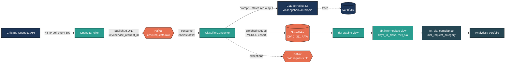
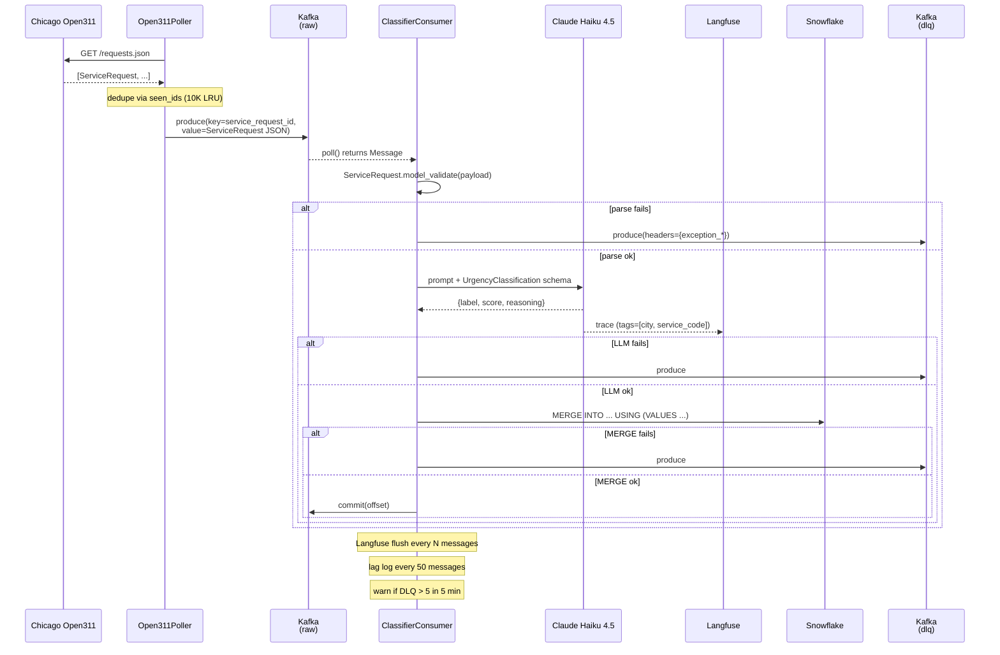
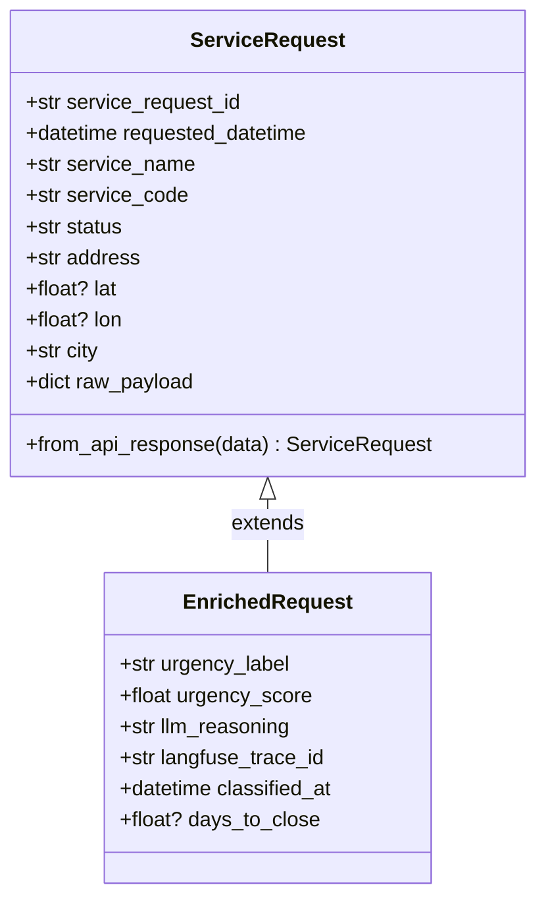

# Architecture

A walkthrough of how a single Chicago 311 service request flows from the
public API through Kafka, an LLM classifier, Snowflake, and dbt — and where
each component's failure modes are handled.

## System overview

Two processes run independently: the **poller** (HTTP → Kafka) and the
**classifier consumer** (Kafka → LLM → Snowflake → optional DLQ). They are
decoupled so that polling cadence does not block on LLM latency, and so
that the consumer can scale horizontally on Kafka partitions if needed.

## Request lifecycle (sequence)

## Component responsibilities

| Component | Owns | Key invariants |
|---|---|---|
| `ingestion/open311_poller.py` | HTTP polling, dedup, schedule | Never blocks; service-code 404s do not stop other codes |
| `ingestion/kafka_producer.py` | JSON serialization, keying | Message key is always `service_request_id` (UTF-8 bytes) |
| `classifier/urgency_classifier.py` | LangChain chain, structured output, Langfuse callback | Exactly one of 4 labels; confidence ∈ [0, 1]; one-sentence reasoning |
| `classifier/consumer.py` | Kafka loop, DLQ routing, observability | `auto.offset.reset=earliest`; manual commit only after warehouse success; signal-safe shutdown |
| `warehouse/snowflake_writer.py` | MERGE upsert, batching, connection lifecycle | Idempotent on `service_request_id`; chunks at 100 rows; VARIANT via `PARSE_JSON` |
| `dbt_project/` | SQL transformations, SLA macro, tests | Staging is a view; marts are tables; SLA thresholds live in `vars` only |

## Data contracts

`ServiceRequest` is the Kafka payload. `EnrichedRequest` is the row written
to `CIVIC_311.RAW.SERVICE_REQUESTS`. The classifier produces an
`EnrichedRequest` from a `ServiceRequest` plus an `UrgencyClassification`
(model output) — no raw dicts cross module boundaries.

## SLA model

Thresholds (hours) are defined exactly once, in `dbt_project.yml`:

| Urgency | Hours | Days |
|---|---:|---:|
| Critical | 4 | 0.17 |
| High | 24 | 1.0 |
| Medium | 72 | 3.0 |
| Low | 168 | 7.0 |

The `sla_threshold_hours()` macro renders a CASE expression from those
vars. `int_resolved_requests` derives `hours_to_close` from
`raw_payload.updated_datetime - requested_datetime` and sets `met_sla =
hours_to_close <= sla_threshold_hours(urgency_label)`. Unknown urgency →
NULL threshold → excluded from `closed_within_sla` and `classified_requests`
but still counted in `total_requests`. `sla_pct` is NULL when
`classified_requests = 0`.

## Failure handling

A failure at any stage routes the **original raw bytes** to the DLQ along
with the exception type and message; the offset commit still happens so
the consumer does not get stuck on a poison message. A separate process
can replay the DLQ once the underlying issue is fixed (LLM outage, schema
drift, transient Snowflake error).

The sliding-window DLQ rate alert (`dlq_rate_alert`, > 5 in 5 min) is a
canary: if it fires, something systemic is wrong — an upstream API change,
expired credentials, a regression in the prompt — and human attention is
warranted.

## Why these choices

- **Kafka, not a queue + DB**: real backpressure, replay, partition-based
  scaling, and log compaction by `service_request_id` if/when needed.
  Realistic for the pattern this project demonstrates.
- **Claude Haiku 4.5, not GPT-4 or a fine-tuned classifier**: ~$0.02 /
  1000 requests at this volume, native structured-output support, and
  excellent semantic reasoning for short policy-style prompts. The
  prompt + macro + schema is portable to any Anthropic model.
- **Langfuse, not a generic APM**: native LangChain callback, free tier
  covers low-volume portfolio work, traces include token counts and
  the structured-output schema by default.
- **Snowflake MERGE, not INSERT or COPY**: idempotency on
  `service_request_id`. Replays do not duplicate. The streaming consumer
  and the bulk backfill use the same writer.
- **dbt staging as view, not incremental**: the source table is small
  (~thousands of rows), and the classifier UPDATEs rows in place without
  bumping `_inserted_at`. A view is always fresh and removes a watermark
  failure mode. Marts that get queried for analytics are tables.
