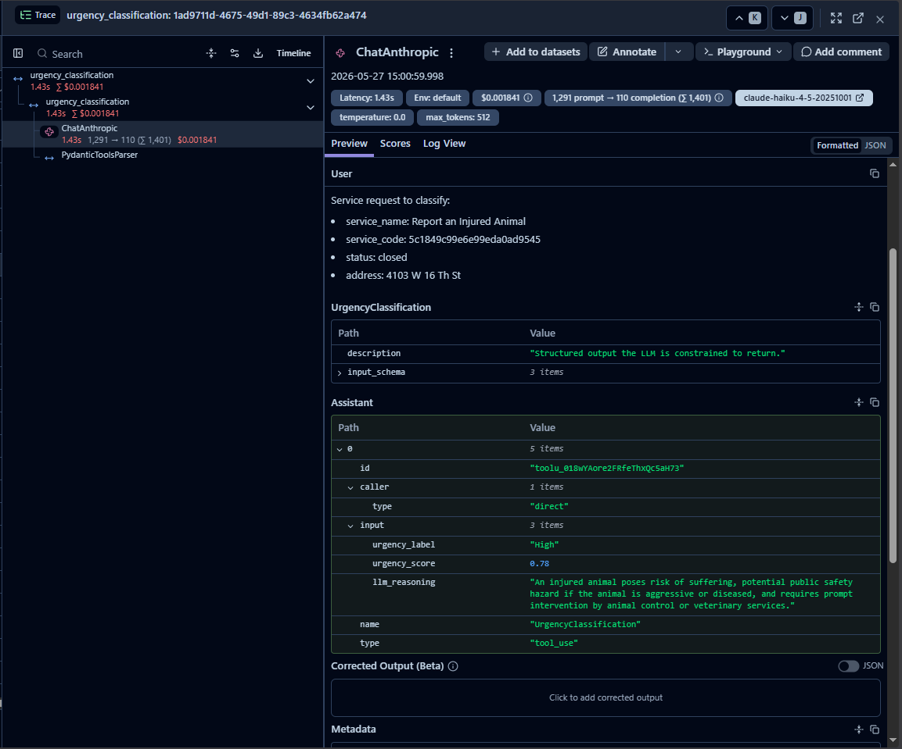
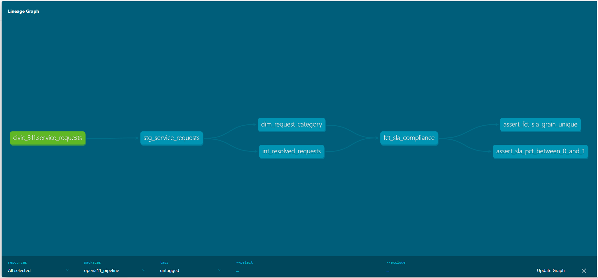
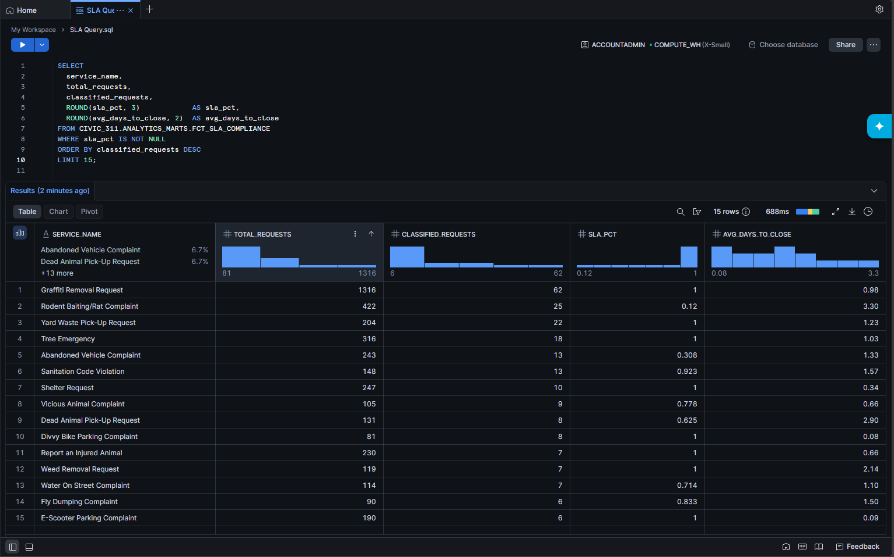

# open311-pipeline

> **Stream → Classify → Warehouse → Model.** Live Chicago 311 requests flow through Kafka, get an urgency tier from Claude Haiku 4.5 (every call traced in Langfuse), land in a warehouse via idempotent `MERGE`, and dbt turns them into department SLA-compliance marts.

**Demonstrates:** Streaming LLM classification into a warehouse with idempotent MERGEs, a DLQ, and dbt tests that fail on drift.

[](https://github.com/tjromack/open311-pipeline/actions/workflows/ci.yml)


---

## Try it — no accounts, no API keys

```bash
git clone https://github.com/tjromack/open311-pipeline.git && cd open311-pipeline
python -m venv .venv && source .venv/bin/activate   # Windows: .\.venv\Scripts\Activate.ps1
pip install -r requirements.txt

make demo-local          # Docker running: fixture -> Kafka -> consumer -> DuckDB -> dbt build -> SLA report
make demo-local-nokafka  # no Docker: fixture -> DuckDB -> dbt build -> SLA report  (~10 s)
```

The demo replays **300 real Chicago 311 requests** with the labels Claude Haiku 4.5 actually gave them
([`data/fixtures/`](data/fixtures/README.md)). They go through the same consumer, `MERGE` writer and dbt
project as a live run. Only the LLM call is swapped for a lookup (`CLASSIFIER_MODE=replay`), and a request
with no recorded label goes to the dead-letter queue instead of getting an invented one. CI runs the no-Kafka
demo on every push.

To classify live instead, set `ANTHROPIC_API_KEY` and see [Full pipeline](#full-pipeline-live-data).

---

## What it is, and who it's for

A working civic-data pipeline and a reusable template for **stream → classify → warehouse → model**: the
shape you'd reach for when an operations team wants model-enriched events in a warehouse they can hold to
account with SQL.

- **For:** data/analytics engineers evaluating the pattern; anyone who wants to see LLM classification
  treated as a pipeline stage with tracing, a DLQ and tests, not a notebook cell.
- **It does:** poll Open311 → publish to Kafka (keyed by `service_request_id`) → classify urgency with
  structured output → route every failure to `civic.requests.dlq` with the exception in the headers →
  `MERGE` into DuckDB (default) or Snowflake → dbt staging / intermediate / marts with 21 data tests.
- **It does not:** dispatch anything, predict close times, or know Chicago's official SLAs (the thresholds
  are this project's, in [`dbt_project.yml`](dbt_project/dbt_project.yml)). See
  [What this does not let me claim](#what-this-does-not-let-me-claim).

---

## Results — reproducible from the committed fixture

Run on **2026-09-23** against the live API: a 7-day backfill of closed requests (**7,493** unique rows,
**125** categories). From those, a seeded random **300** were classified by `claude-haiku-4-5-20251001`,
with 300/300 succeeding in 376 s sequentially. `make demo-local-nokafka` reproduces every number below.

- **87.0%** pooled SLA compliance (261 of 300 classified requests closed within their tier's threshold)
- By tier: Critical **8/14**, High **51/72**, Medium **49/61**, Low **153/153**
  (Low's 100% is an artifact of the sampling window; see [limits](#what-this-does-not-let-me-claim))
- **0** duplicates: Open311 returned 7,503 records across page boundaries for 7,493 unique IDs, and
  `MERGE` absorbed the 10 repeats

Where the model's urgency and the city's close times disagree:

| Category | Model's typical tier | n | Met SLA | Avg days to close |
|---|---|---:|---:|---:|
| Graffiti Removal Request | Low | 63 | 100% | 0.55 |
| Traffic Signal Out Complaint | High | 8 | 88% | 0.37 |
| Tree Emergency | High | 16 | 69% | 0.99 |
| Abandoned Vehicle Complaint | High | 12 | 67% | 1.48 |
| Wire Down | Critical | 5 | 40% | 0.27 |
| **Rodent Baiting / Rat Complaint** | **High** | **4** | **0%** | **2.73** |

> Rodent baiting is classified High (24 h threshold) but averages 2.7 days to close. The first run, in
> May 2026 on Snowflake, showed the same gap (12%, 3.3 days) on a different week of data. At n=4 that is a
> lead worth checking, not a finding.

**Earlier Snowflake run (May 2026).** The Snowflake path was verified live on 2026-05-27: 7,200 rows
backfilled, 300 classified, 0 duplicates across two backfills, and 20/20 dbt tests passing (screenshot below).
The Snowflake trial has since expired, so those rows can't be re-queried, and the numbers above replace them.

---

## How it's verified

**CI on every push** ([`.github/workflows/ci.yml`](.github/workflows/ci.yml)): a clean checkout,
`pip install -r requirements.txt`, the full pytest suite, the no-Kafka demo (every dbt model and data test
against the real fixture), and `dbt parse` against the Snowflake target.

**53 pytest tests**, grouped by the failure each one targets:

| Failure mode | Tests |
|---|---|
| Upstream API misbehaves: HTTP 429, malformed record, duplicate across polls | `tests/test_poller.py` |
| **Schema drift**: renamed/missing/new keys, reformatted timestamps, non-object records, envelope change | `tests/test_schema_drift.py` |
| **Drift reaching the marts**: real fixture builds green; the same data with `updated_datetime` renamed fails `dbt build` on exactly the tripwire test | `tests/test_dbt_drift_tripwire.py` |
| LLM or parse failure must go to the DLQ, never crash the consumer | `tests/test_classifier.py`, `tests/test_replay_classifier.py` |
| Re-delivery must not duplicate: `MERGE` idempotency, batching, UTC normalisation | `tests/test_duckdb_writer.py`, `tests/test_snowflake_writer.py` |
| Agreement metrics are computed correctly (kappa vs. a hand-worked example) | `tests/test_score_labels.py` |

**21 dbt data tests**, all run by `dbt build`:

- *Source (`RAW.SERVICE_REQUESTS`):* `unique` + `not_null` on `service_request_id`; `not_null` on
  `status`, `requested_datetime`; `accepted_values` on `urgency_label`
  (Critical / High / Medium / Low / Unknown)
- *Staging:* the same five checks on `stg_service_requests`
- *Marts:* `unique` + `not_null` on `dim_request_category.service_code`; `not_null` on `service_name`;
  `accepted_values` on `typical_urgency_label`; `not_null` on `fct_sla_compliance` `department`,
  `service_code`, `month`, `total_requests`
- *Singular:* `assert_fct_sla_grain_unique` (department × service_code × month is a key),
  `assert_sla_pct_between_0_and_1`, and **`assert_closed_requests_have_close_time`**, the schema-drift
  tripwire described below

**Classifier agreement with blind hand-labels.** 50 of the 300 were drawn at random with a fixed seed and
labelled without seeing the model's answer, using only the fields the model sees and the prompt's own tier
definitions ([`eval/LABELING_GUIDE.md`](eval/LABELING_GUIDE.md)).
Results: **[TKTK: pending hand-labels, `make score-labels` → [`eval/RESULTS.md`](eval/RESULTS.md)]**

### What happens when Chicago changes the payload

The feed is stable today: in the 2026-09-23 survey, all 7,493 records carried the same 10 keys (one also had
`media_url`, which is optional in the Open311 spec). Here is what each kind of change does:

| Change | Behaviour | Loud? |
|---|---|---|
| A key renamed or dropped (e.g. `long` → `lng`) | Record still ingested; the affected field is NULL; one `open311_schema_drift` warning per fetch naming the missing/new keys and counts | Log warning |
| New key added | Preserved in `raw_payload` (JSON/VARIANT); reported as an unexpected key | Log warning |
| `requested_datetime` missing or reformatted, non-numeric coordinate | That record is skipped with an `open311_record_parse_error`; the rest of the batch flows | Log error; **record not retained** |
| `updated_datetime` renamed or unparseable | **`dbt build` fails** on `assert_closed_requests_have_close_time` when >1% of closed rows lack a close time | **Build fails** |
| Response is an object, not a list | Poll returns nothing and logs `open311_unexpected_payload` | Log error |

The dbt row is the one that matters most. Before the tripwire, a renamed close-time field emptied the SLA
mart and every other test **still passed** (24/24 nodes green on an empty mart; reproduced in
`tests/test_dbt_drift_tripwire.py`).

### What the Langfuse traces hold, and how to spot drift in the classifier

Every live classification is one trace named `urgency_classification`, tagged `[city, service_code,
urgency_classification]`, with metadata `service_request_id` and `prompt_version`, plus the full prompt,
the structured output and input/output token counts. The trace ID is stored on the warehouse row
(`langfuse_trace_id`), so any row in a mart leads back to the exact call that labelled it.

When classification drifts, what to look at:

- **Label mix per `service_code` over time.** Most categories should keep a stable modal tier
  (`dim_request_category.typical_urgency_label`), so a category that flips tier is the first signal.
- **Confidence (`urgency_score`).** The prompt reserves scores below 0.6 for genuine ambiguity. In the
  2026-09-23 sample the minimum was 0.55 and the median 0.85, and a falling median is a cheap early warning.
- **DLQ rate.** The consumer logs `dlq_rate_alert` at more than 5 failures in 5 minutes.
- **Prompt version.** Filter traces by `prompt_version` before comparing periods.



---

## What this does not let me claim

- **Single city, one week, 300 labels.** One Open311 feed (Chicago), one 7-day window, 300 classified
  requests. Per-category SLA percentages rest on small n (4 rodent complaints) and are leads, not findings.
- **SLA compliance is biased upward.** The backfill takes requests *opened* in the last 7 days that are
  *already closed*, so slow requests are still open and excluded. Low's 153/153 is true by construction
  (anything closed within 7 days beats a 168 h threshold). A fair measurement needs a cohort observed until
  it closes.
- **The SLAs are this project's, not the city's.** The 4 / 24 / 72 / 168 h thresholds are chosen per urgency
  tier in `dbt_project.yml`. They are not Chicago's service commitments.
- **"Days to close" is approximate.** It is measured to Open311's `updated_datetime`, which is the last status
  change and is only a proxy for the close time.
- **The model sees very little.** Chicago's feed has no free-text description, so urgency is inferred from
  category, status and street address alone. The same category mostly gets the same tier, so this is closer
  to category triage than to reading a complaint.
- **Agreement is one labeller's judgement** on 50 items, not ground truth, and a random 50 does not cover
  every tier equally.
- **Not production-scale.** One consumer process classifies sequentially (~0.8 requests/s), with no
  load testing, autoscaling or exactly-once guarantees beyond idempotent `MERGE`. `department` is mostly NULL
  (Open311 puts `group` on the services catalog, not on requests).
- **Snowflake mode is not continuously verified.** CI parses it but can't run it, and its last live run was
  May 2026.

---

## Full pipeline (live data)

Live classification needs `ANTHROPIC_API_KEY`. Langfuse keys are optional, and without them the consumer
classifies untraced. Snowflake is optional too: DuckDB is the default warehouse.

```bash
cp .env.example .env          # fill in ANTHROPIC_API_KEY (+ LANGFUSE_* to trace)
make up && make topics        # Kafka + Zookeeper in Docker; civic.requests.raw + .dlq
make run                      # poller + consumer in parallel -> data/civic_311.duckdb (logs/pipeline.log)
make dbt && make dbt-test     # build + test the marts on DuckDB
make report                   # print the SLA mart
```

Or run the pieces individually:

```bash
python -m ingestion.open311_poller --dry-run      # poll once a minute, print JSON instead of producing
python -m classifier.consumer                     # consume, classify, MERGE; Ctrl+C to stop
make backfill DAYS=7                              # historical load, unclassified (urgency_label='Unknown')
make classify LIMIT=300 SEED=311                  # classify a seeded random sample in place
make export-fixture                               # refresh data/fixtures/ from the classified rows
```

`make docs && make docs-serve` builds and serves the dbt docs site at http://localhost:8000.

### Snowflake instead of DuckDB

```bash
# .env: WAREHOUSE_BACKEND=snowflake, DBT_TARGET=snowflake, SNOWFLAKE_* filled in
```

In a Snowsight worksheet, once:

```sql
CREATE DATABASE IF NOT EXISTS CIVIC_311;
CREATE SCHEMA   IF NOT EXISTS CIVIC_311.RAW;
```

then apply [`warehouse/ddl/raw_service_requests.sql`](warehouse/ddl/raw_service_requests.sql) and use the
same `make` targets. The dbt models are shared: the two Snowflake-only SQL constructs go through
[`macros/cross_db.sql`](dbt_project/macros/cross_db.sql), whose Snowflake branch renders the original SQL
unchanged.





---

## Tech stack

| Layer | Technology | Why |
|---|---|---|
| Event broker | **Apache Kafka** (Confluent, Docker) | Decouples polling from processing; replayable; DLQ as a topic |
| Stream source | **Chicago Open311 REST API** | Free, public, high-volume |
| LLM classifier | **Claude Haiku 4.5** via `langchain-anthropic` | Cheap; native structured output |
| LLM tracing | **Langfuse** | LangChain callback; per-call prompt, output, tokens, latency |
| Warehouse | **DuckDB** (default) or **Snowflake** | DuckDB needs no account; Snowflake is the production target. `MERGE` on both |
| Transformation | **dbt Core** (`dbt-duckdb`, `dbt-snowflake`) | SQL models, schema + singular tests, docs |
| Orchestration | Plain **Python 3.12** + `schedule` | Poller and consumer are independent processes |
| CI | **GitHub Actions** | pytest, the no-Kafka demo, and `dbt parse` on every push |

---

## Project layout

```
open311-pipeline/
├── ingestion/                  # Open311 poller (+ drift detection), Kafka producer, Pydantic models
├── classifier/                 # Kafka consumer, Claude classifier, replay classifier, prompts
├── warehouse/                  # DuckDB + Snowflake MERGE writers, DDL, backend factory
├── dbt_project/                # staging / intermediate / marts, cross-db macros, singular tests
├── data/fixtures/              # 300 real requests + recorded Claude labels (replay demo, CI, eval)
├── eval/                       # labeling guide, blind label sheet, agreement results
├── scripts/                    # demo, backfill, classify, fixture export/load, SLA report, label scoring
├── tests/                      # pytest suite
├── docker-compose.yml          # Kafka, Zookeeper, optional self-hosted Langfuse
└── Makefile                    # make help lists every target
```

---

## Configuration

All configuration lives in `.env`; [`.env.example`](.env.example) documents every variable.

| Variable | Purpose |
|---|---|
| `WAREHOUSE_BACKEND` | `duckdb` (default) or `snowflake` |
| `DUCKDB_PATH` | Local warehouse file (default `data/civic_311.duckdb`) |
| `CLASSIFIER_MODE` | `live` (default, calls Claude) or `replay` (recorded labels, no key) |
| `DBT_TARGET` | `local` (default, DuckDB) or `snowflake` |
| `POLL_INTERVAL_SECONDS` | Poll cadence (default 60; never below 30) |
| `SERVICE_CODES` | Comma-separated service codes (empty = all categories) |
| `ANTHROPIC_API_KEY` / `ANTHROPIC_MODEL` | Claude key; model defaults to `claude-haiku-4-5-20251001` |
| `LANGFUSE_PUBLIC_KEY` / `LANGFUSE_SECRET_KEY` / `LANGFUSE_HOST` | Optional tracing |
| `SNOWFLAKE_*` | Only for `WAREHOUSE_BACKEND=snowflake` |
| `OPEN311_VERIFY_TLS` | `false` to skip Open311 hostname verification (see Troubleshooting) |

SLA thresholds and the drift-tripwire threshold live only in `dbt_project.yml` `vars:`, never in SQL.

---

## Troubleshooting

### Local TLS interception (Norton / Avast / corporate proxies)

If endpoint security re-signs TLS (Norton's HTTPS scanning is the usual culprit on Windows), you'll see
`CERTIFICATE_VERIFY_FAILED`, `pip`/`uv` failing with `invalid peer certificate: UnknownIssuer`, or the
Snowflake connector hanging with `250001`. Build a combined CA bundle and point Python at it:

```powershell
# 1. Find the interceptor's root CA
Get-ChildItem -Path Cert:\ -Recurse |
  Where-Object { $_.Subject -like '*Norton*' } | Select-Object PSPath, Thumbprint, Subject

# 2. Export it (replace <thumbprint>)
$cert = Get-ChildItem Cert:\LocalMachine\Root\<thumbprint>
$b64 = [Convert]::ToBase64String($cert.RawData, [Base64FormattingOptions]::InsertLineBreaks)
"-----BEGIN CERTIFICATE-----`r`n$b64`r`n-----END CERTIFICATE-----" | Out-File .certs\interceptor_root.pem -Encoding ASCII

# 3. certifi + interceptor -> combined bundle, then set REQUESTS_CA_BUNDLE in .env
$certifi = .\.venv\Scripts\python -c "import certifi; print(certifi.where())"
(Get-Content $certifi -Raw) + "`r`n" + (Get-Content .certs\interceptor_root.pem -Raw) |
  Out-File .certs\combined_ca.pem -Encoding ASCII
```

**The bundle goes stale.** Norton regenerates its root CA from time to time. If TLS errors come back
months later, compare the thumbprint in step 1 with the cert in your bundle and rebuild. For `uv`,
`--native-tls` uses the Windows store directly.

For Snowflake's OCSP check, set `SF_OCSP_FAIL_OPEN=true`. For Open311, the upstream CDN sometimes serves a
placeholder cert for `empty.spotmobile.net`. If you see "CN name does not match", set
`OPEN311_VERIFY_TLS=false`.

### `dbt run` hangs (Snowflake)

Almost always the OCSP issue above. `dbt_project/logs/dbt.log` stuck at `Opening a new connection` confirms
it.

### `Could not set lock on file` (DuckDB)

DuckDB allows one writer process per file. The pipeline's writer holds the file only for the length of each
`MERGE`, so `dbt` can run alongside it, but a long `dbt build` can briefly block writes (the writer retries
for ~10 s). If you want to query while it runs, open the file with `read_only=True`.

### Stale `urgency_label` in the marts after classifying

Fixed in v1.0.0: staging is a view, so classifier `MERGE` updates show up on the next `dbt run`. On an older
commit, run `dbt run --full-refresh` once.

---

## Roadmap

See [`TODO.md`](TODO.md) and [`CHANGELOG.md`](CHANGELOG.md).

## License

MIT; see [`LICENSE`](LICENSE). Chicago 311 data is published by the City of Chicago via its public Open311
API.
